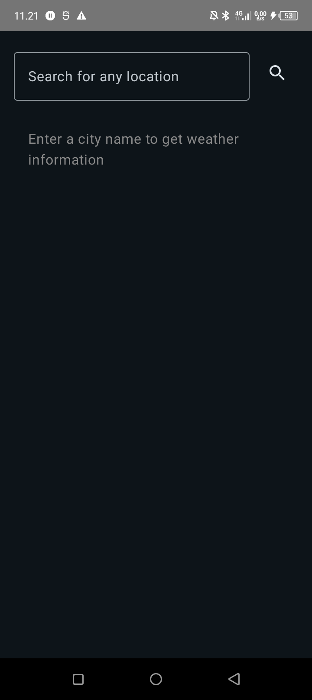
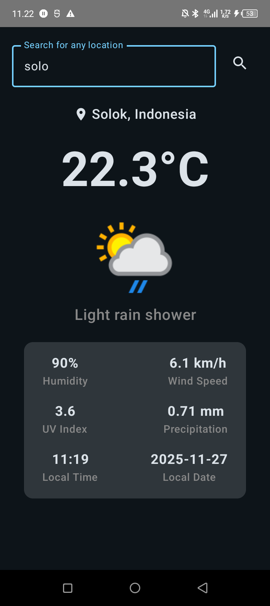

🌦️ Aplikasi Cuaca Sederhana

Aplikasi ini merupakan aplikasi cuaca berbasis Android yang memungkinkan pengguna mencari cuaca berdasarkan nama kota dan menampilkan informasi kondisi cuaca secara realtime.

📱 Fitur Utama

Pencarian cuaca berdasarkan nama kota

Menampilkan:

Suhu saat ini

Kondisi cuaca (cerah, hujan, berawan, dll)

Kelembaban

Kecepatan angin

Tampilan sederhana dan mudah digunakan

🛠️ Teknologi yang Digunakan

Kotlin

Jetpack Compose

Retrofit

API OpenWeatherMap

MVVM Architecture

🔍 Cara Menggunakan

Buka aplikasi

Masukkan nama kota pada kolom pencarian
Contoh: Jakarta

Tekan tombol Cari

Informasi cuaca akan ditampilkan di layar

🌐 API yang Digunakan

Aplikasi ini menggunakan API dari:

https://openweathermap.org/api

📦 Contoh Response yang Ditampilkan

Nama Kota

Suhu: 30°C

Cuaca: Clear Sky

Kelembaban: 70%

Angin: 5 m/s

🖼️ Tampilan Aplikasi

Tampilan terdiri dari:

Input field pencarian kota

Tombol Cari

Card hasil cuaca

⚙️ Cara Menjalankan Project

Clone repository ini

Buka di Android Studio

Tambahkan API Key OpenWeatherMap di file:

local.properties

Contoh:

API_KEY=masukkan_api_key_anda

Run aplikasi di emulator atau perangkat asli

✅ Kelebihan

Ringan dan cepat

Data realtime

UI sederhana

## 📊 Aplikasi

|                                                            |                                                                              |
| ---------------------------------------------------------- | ---------------------------------------------------------------------------- |
|  |  |
Hanya bisa menampilkan cuaca saat ini

Tidak ada fitur prakiraan harian
